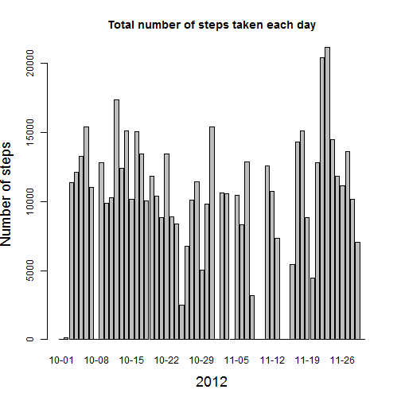
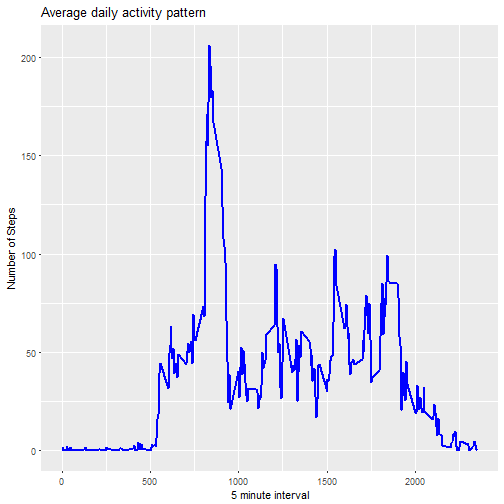
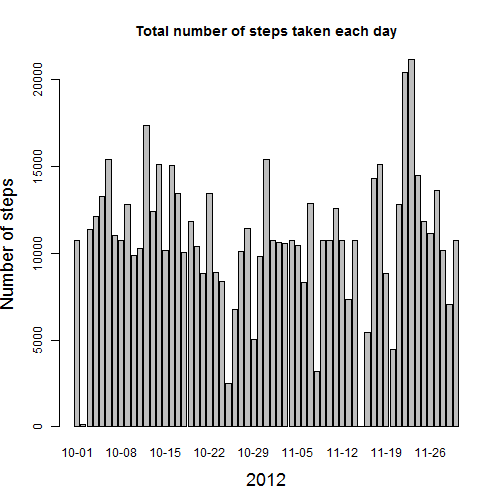
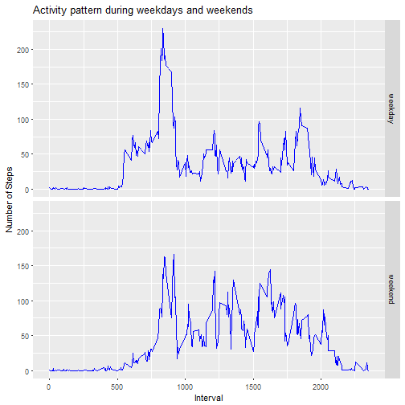

#  

# Analysing Personal Activity Monitoring Data


The device collects data at 5 minute intervals through out the day. The data consists of two months of data from an anonymous individual collected during the months of October and November, 2012 and include the number of steps taken in 5 minute intervals each day.

The variables included in this dataset are:

1. steps: Number of steps taking in a 5-minute interval (missing values are coded as NA)
2. date: The date on which the measurement was taken in YYYY-MM-DD format
3. interval: Identifier for the 5-minute interval in which measurement was taken

The dataset is stored in a comma-separated-value (CSV) file and there are a total of 17,568 observations in this dataset.


Let us first load the required libraries for this analysis.


```r
  library(dplyr)
  library(ggplot2)
```


## Loading and processing the data


```r
act <- read.csv("activity.csv")
```

To find out the total number of steps taken per day let us first group the data by date and draw a bar plot.


```r
  by_date <- group_by(act, date)
  totSteps <- summarise(by_date, Tsteps=sum(steps, na.rm = TRUE))

  barplot(height=totSteps$Tsteps, names.arg = substr(totSteps$date,6,10), 
        xlab = substr(totSteps$date[1],1,4), ylab = "Number of steps",
        main = "Total number of steps taken each day", cex.lab=1.5)
```



The Mean and median number of steps taken each day are:


```r
  mean(totSteps$Tsteps)
```

```
## [1] 9354.23
```

```r
  median(totSteps$Tsteps)
```

```
## [1] 10395
```

## Daily activity pattern.

Let us split the data by interval and understand when during the day the
activity is more.


```r
  ## Time series plot of the average number of steps taken
  by_interval <- group_by(filter(act, !is.na(steps)),
                                interval)
  totStepsAvg <- summarise(by_interval, Avg.Steps=mean(steps))

  g <- ggplot(totStepsAvg, aes(interval, Avg.Steps))
  g+geom_line(color="blue", size=1)+ 
    labs(title="Average daily activity pattern", 
         y="Number of Steps", x="5 minute interval")
```


  
As is evident from the plot, the time interval between 8 AM to 9 AM contains maximum number of steps.

## Imputing missing value
Let us understand how many NAs are there in the data and see if there is a way for us to fill these missing values.

```r
  sum(is.na(act$steps))
```

```
## [1] 2304
```

Since there are so many missing values, let us fill them with the mean for that 5-minute interval. We will create a new data frame with the missing values filled.

Let us first create a copy of the data and then fill the missing values.

```r
  actNew <- act

  ## replace NAs with average steps for the corresponding interval
  for (i in 1:dim(act)[1]){
    if (is.na(actNew$steps[i]))
      actNew$steps[i] <- totStepsAvg$Avg.Steps[totStepsAvg$interval==actNew$interval[i]]
  }
```

Let us now look at the total number of steps taken per day with the missing values take care.

```r
  ## Group the new dataset by date
  by_dateNew <- group_by(actNew, date)
  totStepsNew <- summarise(by_dateNew, Tsteps=sum(steps))

  ## Histogram of the total number of steps taken each day
  barplot(height=totStepsNew$Tsteps, names.arg = substr(totStepsNew$date,6,10), 
          xlab = substr(totStepsNew$date[1],1,4), ylab = "Number of steps",
          main = "Total number of steps taken each day", cex.lab=1.5)
```


  
Let us see how the imputed values have impacted the mean and median.

```r
  mean(totStepsNew$Tsteps)
```

```
## [1] 10766.19
```

```r
  median(totStepsNew$Tsteps)
```

```
## [1] 10766.19
```
As we can see, both mean and median have increased compared to what they were earlier.

## Weekends vs. Weekdays
Let us next analyse the new dataset to see how the activity pattern is during weekdays as opposed to weekends.

```r
  ## Let us add a column to the dataset to differentiate weekdays and weekends
  actNew$day <- "weekday"
  weekEnd <- weekdays(as.Date(actNew$date)) %in% c("Saturday", "Sunday")
  actNew$day[weekEnd] <- "weekend"
  
  ## Group the data by interval and weekday/weekend
  by_intervalDay <- group_by(actNew, interval,day)
  totStepsAvgNew <- summarise(by_intervalDay, Avg.Steps=mean(steps))
  
  ## Panel plot comparing the average number of steps taken per 5-minute 
  ## interval across weekdays and weekends
  g <- ggplot(totStepsAvgNew, aes(interval, Avg.Steps))
  g+geom_line(color="blue")+facet_grid(day~.)+ 
    labs(title="Activity pattern during weekdays and weekends", 
         y="Number of Steps", x="Interval")
```



From the plots it is clear that there are more steps taken betwen 10 AM and 8 PM during weekends than over weekdays. 
